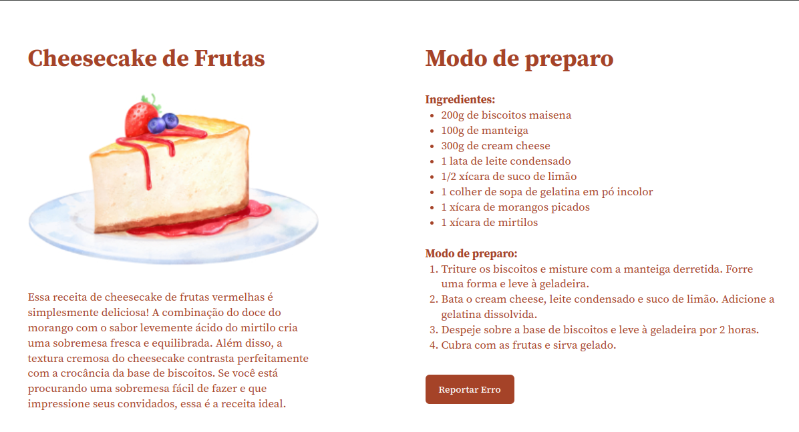

# Fruit Cheesecake

This project is a simple web application showcasing a delicious fruit cheesecake recipe.



## Table of Contents

- [Overview](#overview)
- [Technologies Used](#technologies-used)
- [Installation](#installation)
- [Usage](#usage)
- [Contributing](#contributing)
- [License](#license)
- [Contact](#contact)

## Overview

This project presents a mouth-watering fruit cheesecake recipe. The combination of sweet strawberries and slightly tart blueberries creates a fresh and balanced dessert. Additionally, the creamy texture of the cheesecake contrasts perfectly with the crunchy biscuit base. If you're looking for an easy-to-make dessert that will impress your guests, this is the ideal recipe.

## Technologies Used

- HTML5
- CSS3

## Installation

To run this project locally, follow the steps below:

1. Clone the repository:

    ```bash
    git clone https://github.com/your-username/repository-name.git
    ```

2. Navigate to the project directory:

    ```bash
    cd repository-name
    ```

3. Open the `index.html` file in your browser.

## Usage

To use the application, simply open the `index.html` file in your browser. You will see a beautifully styled page with a fruit cheesecake recipe.

### Project Structure

- `index.html`: Main structure of the application.
- `style.css`: Styles used for the application.

### Example of Usage

1. Open `index.html` in your browser.
2. Follow the recipe instructions to make a delicious fruit cheesecake.
